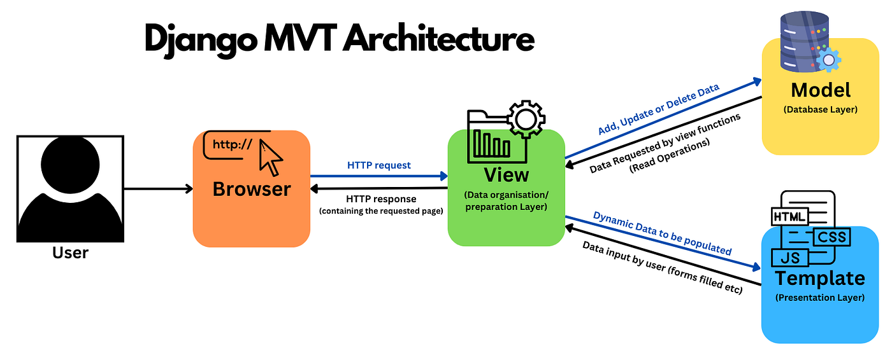

friliani-gloria-footballshop.pbp.cs.ui.ac.id

1. implementasi
- Saya memulai dengan membuat project Django baru. Diawali dengan 
mengaktifkan environment, kemudian menjalankan django-admin startproject football_shop .
- Kemudian saya membuat aplikasi baru bernama main. Di dalam folder main juga berisi file-file inti seperti models.py, views.py, sub-folder templates, dan lainnya.
- kemudian saya tambahkan main ke INSTALLED-APPS pada settings.py
- selanjutnya saya membuat model Product dan menambahkan atribut wajib (name, price, description, thumbnail, category, is_featured), dengan tipe yang sudah ditentukan juga, pada models.py.
- kemudian saya membuat fungsi pada views.py yang akan dikembalikan ke template html. saya juga menambahkan template html untuk menampilkan data dari view ke browser.
- selanjutnya saya membuat sebuah routing pada urls.py.
- kemudian saya melakukan migrasi database.
- terakhir, saya melakukan deployment ke PWS.

2. 
alur:
- client mengakses URL
- request masuk ke urls.py project
- Django mencari pola URLnya, kemudian mengarahkan ke fungsi di views.py pada aplikasi.
- fungsi di views.py bisa mengambil atau mengolah data dari models.py
- data dikirim ke template HTML untuk ditampilkan ke user
- django mengembalikan HTTP Response ke browser client

3. peran settings.py
settings.py menyimpan konfigurasi global project, seperti daftar aplikasi, database yang dipakai, templates, dan lainnya. settings.py berisi pengaturan dasar project.

4. cara kerja migrasi database
saat kita ubah models.py, django belum langsung mengubah database. 
python manage.py makemigrations -> membuat file migrasi
python manage.py migrate -> mengeksekusi file miggrasi ke database 
migrasi membuat perubahan database terkontrol.

5. mengapa Django?
karena framework django memiliki banyak fitur bawaan yang sangat berguna, memiliki struktur yang jelas, dan menerapkan standar pengembangan yang rapi, mengajarkan pola pikir clean code apalagi untuk pemula. django juga sudah sangat populer dan memiliki dokumentasi yang cukup lengkap, jadi mudah dipelajari.

6. feedback untuk asdos tutorial 1
so far, saya belum ada feedback apapun untuk asisten dosen karena saya juga belum mengalami banyak masalah dalam pengerjaan tutorial.
