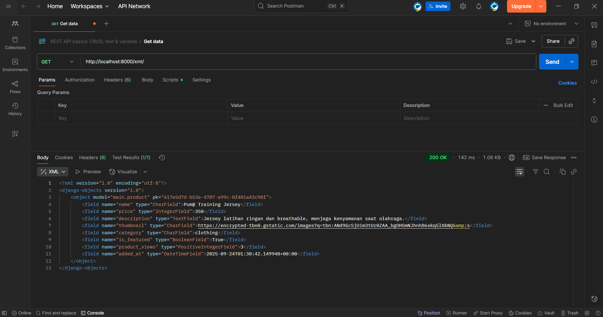
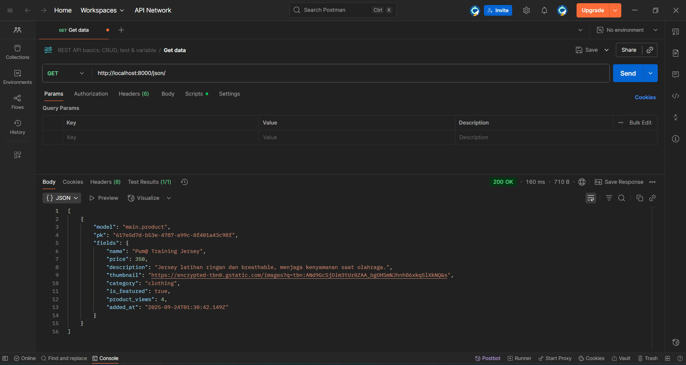
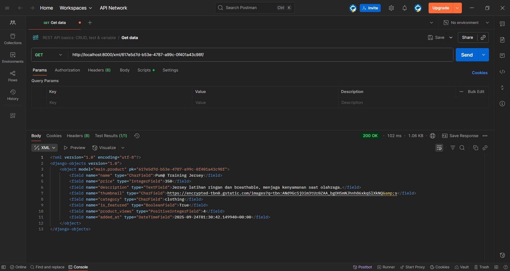
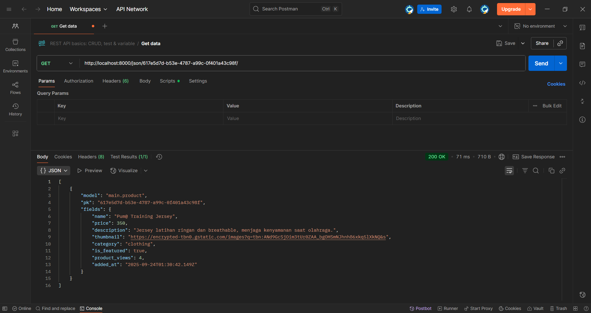

friliani-gloria-footballshop.pbp.cs.ui.ac.id

<b>Tugas 2</b>

1. implementasi
- Saya memulai dengan membuat project Django baru. Diawali dengan
mengaktifkan environment, kemudian menjalankan django-admin startproject football_shop .
- Kemudian saya membuat aplikasi baru bernama main. Di dalam folder main juga berisi file-file inti seperti models.py, views.py, sub-folder templates, dan lainnya.
- kemudian saya tambahkan main ke INSTALLED-APPS pada settings.py
- selanjutnya saya membuat model Product dan menambahkan atribut wajib (name, price, description, thumbnail, category, is_featured), dengan tipe yang sudah ditentukan juga, pada models.py.
- kemudian saya membuat fungsi pada views.py yang akan dikembalikan ke template html. saya juga menambahkan template html untuk menampilkan data dari view ke browser.
- selanjutnya saya membuat sebuah routing pada urls.py.
- kemudian saya melakukan migrasi database.
- terakhir, saya melakukan deployment ke PWS.

2. 
alur:

- client mengakses URL
- request masuk ke urls.py project
- Django mencari pola URLnya, kemudian mengarahkan ke fungsi di views.py pada aplikasi.
- fungsi di views.py bisa mengambil atau mengolah data dari models.py
- data dikirim ke template HTML untuk ditampilkan ke user
- django mengembalikan HTTP Response ke browser client

3. peran settings.py
settings.py menyimpan konfigurasi global project, seperti daftar aplikasi, database yang dipakai, templates, dan lainnya. settings.py berisi pengaturan dasar project.

4. cara kerja migrasi database
saat kita ubah models.py, django belum langsung mengubah database.
python manage.py makemigrations -> membuat file migrasi
python manage.py migrate -> mengeksekusi file miggrasi ke database
migrasi membuat perubahan database terkontrol.

5. mengapa Django?
karena framework django memiliki banyak fitur bawaan yang sangat berguna, memiliki struktur yang jelas, dan menerapkan standar pengembangan yang rapi, mengajarkan pola pikir clean code apalagi untuk pemula. django juga sudah sangat populer dan memiliki dokumentasi yang cukup lengkap, jadi mudah dipelajari.

6. feedback untuk asdos tutorial 1
so far, saya belum ada feedback apapun untuk asisten dosen karena saya juga belum mengalami banyak masalah dalam pengerjaan tutorial.

<b>Tugas 3</b>

1. Data delivery dibutuhkan agar bisa ada pertukaran data antar sistem
2. JSON lebih baik dan lebih populer karena formatntya lebih ringkas dan mudah dibaca, juga lebih ringan.
3. is_valid() digunakan untuk validasi data yang dimasukkan user ke dalam form. tanpa itu, aplikasi bisa menerima input yang salah atau mungkin berbahaya.
4. jika tidak ada csrf_token, penyerang bisa membuat form palsu di situs lain yang secara diam-diam mengirim permintaan ke aplikasi kita. dengan csrf_token, Django bisa memastikan request memang berasal dari form milik aplikasi kita, bukan dari pihak luar.
5. saya mengimplementasikan dimulai dari menambahkan fungsi-fungsi views baru, kemudian membuat routing untuk URL untuk masing-masing views, membuat fitur add product, dimana saya membuat tombol add product yang membawa kita ke halaman form, kemudian membuat fitur untuk melihat detail product.
6. tidak ada feedback.

<b>Tugas 4</b>

1. 
Django AuthenticationForm adalah form bawaan DJango yang digunakan untuk fitur login. Form ini otomatis menyediakan field username dan password, juga melakukan validasi. Kelebihan dari AuthenticationForm yaitu sudah terintegrasi dengan sistem autentikasi Django, validasi login sudah built-in, mendukung hashing password jadi aman, mudah digunakan karena cukup dipanggil tanpa harus menulis form dari awal. Di sisi lain, AuthenticationForm memiliki kekurangan yaitu kurang fleksibel jika butuh field tambahan (ex. OAuth seperti login dengan email atau OTP), styling terbatas (perlu dikustomisasi agar sesuai UI/UX), dan hanya cocok untuk skenario standar,tidak bisa untuk kebutuhan autentikasi kompleks.

2. 
Autentikasi: verifikasi identitas user. Diimplementasikan melalui django.contrib.auth, misal AuthenticationForm, login(), logout(), dan model User

Otorisasi: pemberian akses setelah user terautentikasi. Diimplementasikan dengan melalui permission system dan decorator (ex: @login_required)

3. 
- Session
    Kelebihan   :   data disimpan di server (lebih aman), bisa menyimpan data kompleks, tidak ter expose langsung ke client.
    Kekurangan  :   server jadi membutuhkan tempat penyimpanan tambahan dan membutuhkan mekanisme cookies untuk menyimpan session ID.
- Cookies
    Kelebihan   :   disimpan di client (tidak membebani server), lebih mudah untuk menyimpan preferensi user
    Kekurangan  :   rentan terhadap manipulasi jika tidak dienkripsi, ukurannya terbatas, tidak cocok untuk data sensitif
    
4. penggunaan cookies memiliki potensi yang beresiko, seperti bisa dicuri lewat serangan XSS, bisa di-sniffing jika tidak menggunakan HTTPS, dan bisa dimodifikasi user. Django mengatasinya dengan beberapa cara salah satunya dengan menggunakan CSRF token.

5. tahapan:
- register
    > menggunakan UserCreationForm untuk form pendaftaran
    > menambahkan register() di views.py -> render form & buat akun baru
    > menambahkan register.html untuk tampilan form
    > membuat url path untuk register

- login
    > menggunakan AuthenticationForm dan fungsi authenticate serta login
    > menambahkan login_user() di views.py
    > menambahkan login.html
    > membuat url path untuk login

- logout
    > menambahkan logout_user() di views.py
    > menambahkan button logout di main.html
    > membuat url path untuk logout

- restriksi akses
    > menggunakan @login_required(login_url='/login') di show_main dan add_product agar halaman hanya bisa diakses user yang sudah login

- cookies untuk last_login  
    > menyimpan timestamp login di cookie last_login
    > menampilkannya di main.html
    > cookies dihapus saat logout

- hubungkan model Product dengan User
    > menambahkan field user
    > set user saat add_product
    > membuat filter berdasarkan user
    > menambahkan tombol filter di main.html
    > menampilkan author di product_detail.html

<b>Tugas 5</b>

**1.** Jika terdapat beberapa CSS selector untuk suatu elemen HTML, jelaskan urutan prioritas pengambilan CSS selector tersebut!

> **A:** Urutan prioritas adalah sebagai berikut:
> * Inline Style : ditempatkan langsung di elemen HTML 
> * Internal Style Sheet : ditempatkan di tag `<style>` dalam `<head>`
> * External Style Sheet : dihubungkan melalui tag `<link>`
> * Browser Default : style bawaan browser

**2.** Mengapa responsive design menjadi konsep yang penting dalam pengembangan aplikasi web? Berikan contoh aplikasi yang sudah dan belum menerapkan responsive design, serta jelaskan mengapa!

> **A:** responsive design penting karena kebanyakan user mengakses web lewat mobile dan juga karena untuk memastikan user experience yang optimal di berbagai ukuran layar. 
Contoh yang sudah responsif web e-commerce modern seperti tokopedia dan amazon. Tampilannya rapi dan berubah dari grid di dekstop menjadi tumpukan di mobile.
Contoh yang belum responsif adalah aplikasi yang tampilan desktopnya dipaksakan ke layar mobile, perlu zoom dan scroll untuk mengakses fitur-fitur.

**3.** Jelaskan perbedaan antara margin, border, dan padding, serta cara untuk mengimplementasikan ketiga hal tersebut!

> **A:** 
> * Margin adalah jarak antar border elemen dengan elemen lain di sekitarnya. Margin digunakan untuk mengontrol ruang di luar elemen, agar ada pemisah antara elemen yang berbeda.
> * Border adalah garis yang mengelilingi padding dan konten elemen. Fungsinya untuk memvisualisasikan batas luar elemen.
> * Padding adalah jarak antar konten elemen (teks, gambar) dan bordernya. Fungsinya untuk mengontrol ruang di dalam elemen.

**4.** Jelaskan konsep flex box dan grid layout beserta kegunaannya!

> **A:** 
> * flexbox adalah sistem tata letak satu dimensi. ini berfokus pada distribusi ruang dan penyejajaran item di sepanjang satu sumbu pada satu waktu: baik horizontal maupun vertikal. Kegunaannya ideal untuk komponen kecil seperti navbar, buttons, penempatan item di dalam sebuah kotak.
> * grid layout adalah sistem tata letak dua dimensi yang memungkinkan pengaturan tata letak dalam baris dan kolom. kegunaannya ideal untuk tata letak halaman yang lebih besar dan kompleks, seperti struktur keseluruhan page web.

**5.** Jelaskan bagaimana cara kamu mengimplementasikan checklist di atas secara step-by-step (bukan hanya sekadar mengikuti tutorial)!

> **A:**
> * membuat fungsi untuk edit dan delete produk di views.py, juga menambahkan url path nya di urls.py. juga menambahkan button edit & delete
> * kustomisasi desain web dengan css tailwind. mengubah desain halaman-halaman berikut: login, register, add_product, edit_product, detail_product, dan desain main juga card product.
> * membuat navigation bar yang responsif untuk di desktop dan mobile.

